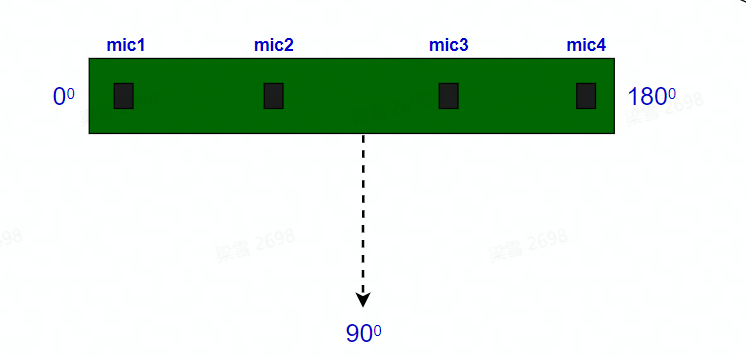

# 功能介绍

hobot_audio package是地平线机器人开发平台的一部分，通过阅读本文档，用户可以在地平线X3开发板上采集音频并且对音频进行AI智能处理，音频数据以及AI结果可以用于其他功能的开发。

hobot_audio package源码包含config、audio_capture、audio_engine、horizon_speech_sdk、config等几个部分。

config部分包括hobot_audio package运行所需的配置以及加载功能启动所需要运行的一些脚本。

audio_capture主要用于采集原始音频，并且负责将智能语音处理之后的智能数据结果通过自定义的audio_msg::msg::SmartAudioData消息发布出去，供给用户订阅使用，可用于唤醒设备之后进行设备控制等。

audio_engine部分将采集到的原始音频数据送入智能语音sdk做智能处理，内部包括智能语音sdk的初始化、启动、送音频数据给sdk处理、sdk的停止等，同时会将智能语音sdk处理后的智能语音数据回调给到audio_capture部分。

horizon_speech_sdk部分主要包括地平线智能语音处理sdk的头文件以及库，内部封装了算法模型推理过程。sdk智能处理结果包括唤醒事件、命令词、声源定位的Doa等信息，这些智能信息会通过回调给到hobot_audio package处理并且发布audio_msg::msg::SmartAudioData类型消息。

hobot_audio package发布的智能语音消息中的声源定位Doa信息单位为角度，取值范围：0度~180度。角度的相对位置关系与麦克风的安装位置强相关，计算示意图如下：



即麦克风安装的正前方为90度，从麦克风1开始沿正前方到麦克风4的方向画半圆即为0度到180度的范围。

hobot_audio package内部使用的语音智能处理sdk是离线模式，不需要在线与云端通讯。

此Package的语音算法sdk适用于与X3适配的线性四麦的麦克风阵列。


# 编译

## 依赖库

- horizon_speech_sdk
- audio_msg

horizon_speech_sdk是地平线封装的对原始语音进行智能处理的sdk，内部封装了语音的算法处理部分，包括降噪、唤醒、语音VAD、ASR、Doa等处理，此package仅处理唤醒以及ASR识别的命令词部分功能。

audio_msg为自定义的智能音频帧消息格式，用于算法模型推理后，发布推理结果，audio_msg pkg定义在hobot_msgs中。

## 开发环境

- 编程语言: C/C++
- 开发平台: X3/X86
- 系统版本：Ubuntu 20.0.4
- 编译工具链:Linux GCC 9.3.0/Linaro GCC 9.3.0

## 编译

 支持在X3 Ubuntu系统上编译和在PC上使用docker交叉编译两种方式。

### Ubuntu板端编译

1. 编译环境确认 
   - 板端已安装X3 Ubuntu系统。
   - 当前编译终端已设置TogetherROS环境变量：`source PATH/setup.bash`。其中PATH为TogetherROS的安装路径。
   - 已安装ROS2编译工具colcon，安装命令：`pip install -U colcon-common-extensions`
2. 编译

编译命令：`colcon build --packages-select hobot_audio`

### Docker交叉编译

1. 编译环境确认

   - 在docker中编译，并且docker中已经安装好TogetherROS。docker安装、交叉编译说明、TogetherROS编译和部署说明详见机器人开发平台robot_dev_config repo中的README.md。

2. 编译

   - 编译命令：

```
export TARGET_ARCH=aarch64
export TARGET_TRIPLE=aarch64-linux-gnu
export CROSS_COMPILE=/usr/bin/$TARGET_TRIPLE-

colcon build --packages-select hobot_audio \
   --merge-install \
   --cmake-force-configure \
   --cmake-args \
   --no-warn-unused-cli \
   -DCMAKE_TOOLCHAIN_FILE=`pwd`/robot_dev_config/aarch64_toolchainfile.cmake
```

## 注意事项

编译需要依赖horizon_speech_sdk以及其依赖的算法库。horizon_speech_sdk 以及算法推理库由地平线编译好提供，目前已包括在hobot_audio package里面。


# 使用介绍

## 依赖

## 参数

| 参数名               | 类型        | 解释               | 是否必须 | 支持的配置       | 默认值       |
| -------------------- | ----------- | ------------------ | -------- | ---------------- | ------------ |
| config_path          | std::string | 配置文件路径       | 否       | 根据实际情况配置 | ./config     |
| audio_pub_topic_name | std::string | 音频智能帧发布话题 | 否       | 根据实际情况配置 | /audio_smart |

audio_config.json配置文件参数说明：

| 参数名               | 类型 | 解释                         | 是否必须 | 支持的配置       | 默认值 |
| -------------------- | ---- | ---------------------------- | -------- | ---------------- | ------ |
| micphone_enable      | int  | 是否使能麦克风               | 是       | 0/1              | 1      |
| micphone_rate        | int  | 麦克风采样率                 | 否       | 16000            | 16000  |
| micphone_chn         | int  | 麦克风通道数                 | 是       | 根据实际硬件配置 | 6      |
| micphone_buffer_time |      | 环形缓冲区长度时间，单位微妙 | 否       | 根据实际情况配置 | 0      |
| micphone_nperiods    |      | 周期时间，单位微妙           | 否       | 根据实际情况配置 | 4      |
| micphone_period_size |      | 音频包大小                   | 否       | 根据实际情况配置 | 512    |

cmd_word.json

此配置文件配置语音智能分析部分的唤醒词以及命令词，配置文件的第一项为唤醒词，后面的是命令词。默认配置文件配置如下：

```
{
    "cmd_word": [
        "地平线你好",
        "向前走",
        "向后退",
        "向左转",
		"向右转",
		"停止运动"
    ]
}
```

唤醒词以及命令词用户可以根据需要配置，若更改唤醒词效果可能会与默认的唤醒词命令词效果有差异。推荐唤醒词以及命令词使用中文，最好是朗朗上口的词语，且词语长度推荐使用3~5个字。


## 运行

编译成功后，将生成的install路径拷贝到地平线X3开发板上（如果是在X3上编译，忽略拷贝步骤），并执行如下命令运行：

### **Ubuntu**

运行方式1，使用ros2 run启动：

```
export COLCON_CURRENT_PREFIX=./install
source ./install/setup.bash
# config中为示例使用的模型，根据实际安装路径进行拷贝
# 如果是板端编译（无--merge-install编译选项），拷贝命令为cp -r install/PKG_NAME/lib/PKG_NAME/config/ .，其中PKG_NAME为具体的package名。
cp -r install/lib/hobot_audio/config/ .

# 加载音频驱动，设备启动只需要加载一次
bash config/audio.sh

# 启动音频处理pkg
ros2 run hobot_audio hobot_audio

```
运行方式2，使用launch文件启动：
```
export COLCON_CURRENT_PREFIX=./install
source ./install/setup.bash
# config中为示例使用的模型，根据实际安装路径进行拷贝
# 如果是板端编译（无--merge-install编译选项），拷贝命令为cp -r install/PKG_NAME/lib/PKG_NAME/config/ .，其中PKG_NAME为具体的package名。
cp -r install/lib/hobot_audio/config/ .

# 启动launch文件
ros2 launch install/share/hobot_audio/launch/hobot_audio.launch.py

```

### **Linux**

```
export ROS_LOG_DIR=/userdata/
export LD_LIBRARY_PATH=${LD_LIBRARY_PATH}:./install/lib/

# config中为示例使用的模型，根据实际安装路径进行拷贝
cp -r install/lib/hobot_audio/config/ .

# 加载音频驱动，设备启动只需要加载一次
sh config/audio.sh

# 启动音频处理pkg
./install/lib/hobot_audio/hobot_audio

```

## 注意事项

1. 用户若需要自定义唤醒词或者命令词，可以修改hobot_audio pkg的config文件夹下的cmd_word.json文件

2. 本package封装的音频智能处理sdk主要针对与X3适配的线性四麦的麦克风，若用户更换麦克风硬件，可能需要自行适配音频驱动等，此外，算法处理效果也可能会有差异；若硬件有变化，可根据硬件通道数具体情况修改hobot_audio pkg的config文件夹下的audio_config.json配置文件，保证配置的麦克风通道数以及参考信息的通道信息等的正确性，从而确保输入音频智能处理sdk的音频数据的正确性。

   

# 结果分析

## X3结果展示

```
alsa_device_init, snd_pcm_open. handle((nil)), name(hw:0,0), direct(1), mode(0)
snd_pcm_open succeed. name(hw:0,0), handle(0x557d6e4d00)
Rate set to 16000Hz (requested 16000Hz)
Buffer size range from 16 to 20480
Period size range from 16 to 10240
Requested period size 512 frames
Periods = 4
was set period_size = 512
was set buffer_size = 2048
alsa_device_init. hwparams(0x557d6e4fa0), swparams(0x557d6e5210)
```

以上log显示，音频alsa设备初始化成功，并且打开了音频设备，可正常采集音频。

## web效果展示


# 常见问题
1、无法打开音频设备？

1.1 确认音频设备接线是否正常

1.2 确认是否加载音频驱动

